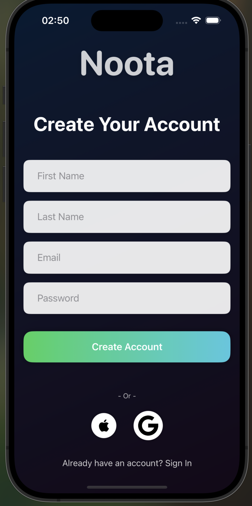
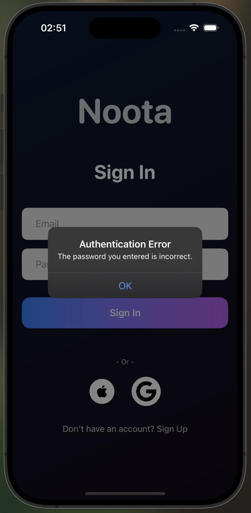
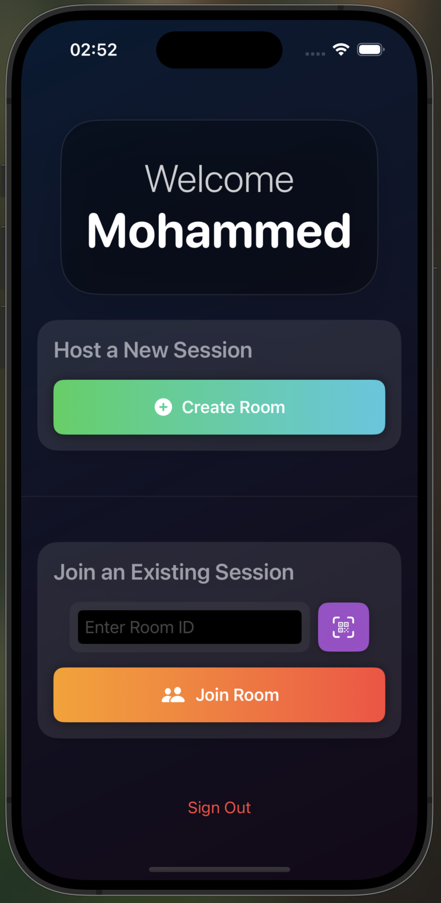
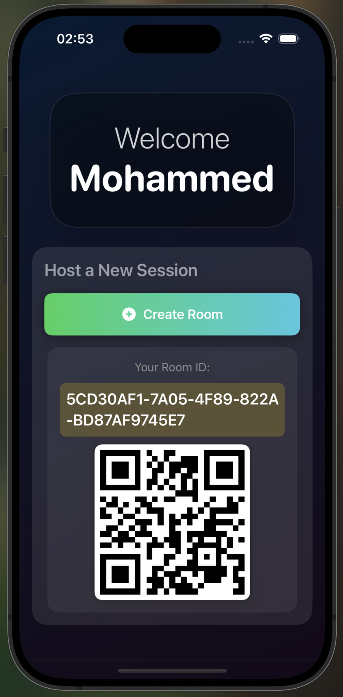
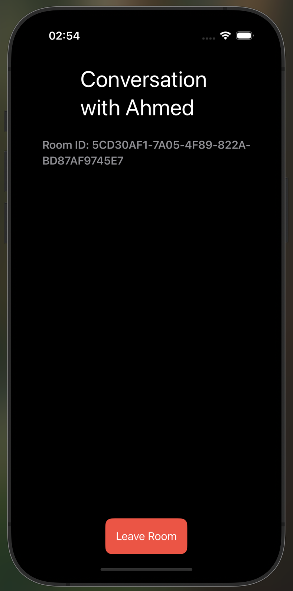
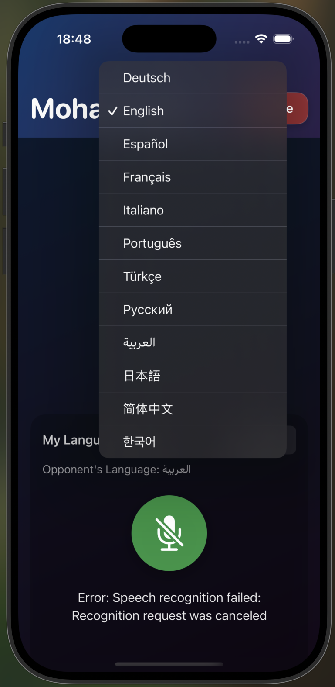
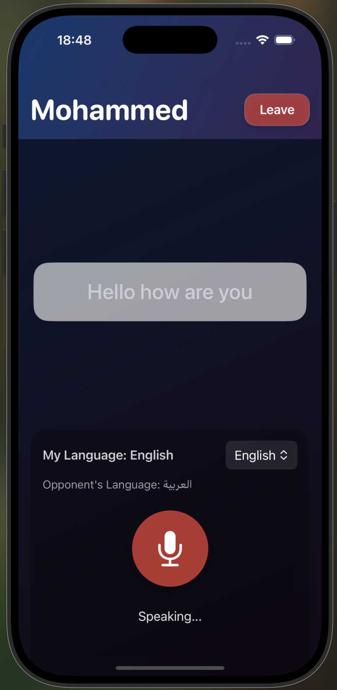
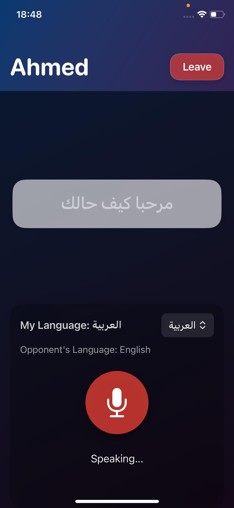

# Noota: AI-Powered Live Voice Translation App
App Demo: https://youtu.be/37KYB2-55Kk?si=M__kGwKftzlxyCqf

**Noota** is an innovative voice communication application that enables real-time, multilingual conversations. Two people speaking different languages can communicate naturally - each hears the other person's voice translated into their native language while preserving the original speaker's unique tone and vocal characteristics.

---

## Core Features

- **Real-Time AI Voice Translation**: Speak in your native language; the other person instantly hears you in theirs
- **Advanced Voice Cloning**: Maintains natural tone, emotion, and vocal characteristics using fine-tuned XTTS v2
- **Instant Room Creation**: Start conversations with a single tap
- **QR Code & Room ID Sharing**: Multiple join methods for flexibility
- **End-to-End Encrypted**: Private peer-to-peer conversations
- **Multi-Language Support**: 10+ languages supported with near-native pronunciation

---

## Technology Stack

### Frontend (iOS)
- **Framework**: SwiftUI
- **Architecture**: MVVM with Combine reactive programming
- **Audio Processing**: AVFoundation with custom streaming optimization
- **Real-time Speech Recognition**: Native Speech framework

### Backend
- **Runtime**: Node.js with Express.js
- **AI Models**: 
  - **XTTS v2**: Fine-tuned voice synthesis engine (1 month custom training)
  - **Gemini API**: Multilingual translation with context awareness
  - **Hugging Face Transformers**: NLP preprocessing
- **Database**: Firebase Firestore (real-time message sync)
- **Storage**: Firebase Cloud Storage (voice profiles & generated audio)

---

## Advanced XTTS v2 Implementation

This project features a **custom fine-tuned XTTS v2 model** trained for 1 month with:

- **Voice Profile Caching**: Eliminates redundant embedding calculations
- **Streaming Optimization**: Downloads chunks progressively for immediate playback
- **GPU Acceleration Support**: Optimized for both CUDA and CPU inference
- **Automatic Voice Normalization**: Preprocessing for consistent quality
- **Multi-language Voice Adaptation**: Specialized training across 10+ languages

---

## Quick Start

### Prerequisites
- iOS 15.0+
- Node.js 16+
- Python 3.11+
- Firebase Account

### Installation & Running

1. **Clone Repository**
   ```bash
   git clone https://github.com/Alansi775/NootaApp.git
   cd NootaApp
   ```

2. **Start All Services**
   ```bash
   bash NootaBackend/start-all.sh
   ```
   This script automatically:
   - Starts the XTTS v2 voice synthesis server (port 8000)
   - Launches the Node.js backend (port 3000)
   - Initializes Firebase connections
   - Warms up the AI models

3. **Run iOS App**
   ```bash
   cd Noota
   xed .
   # Select target device/simulator and press Cmd+R
   ```

### Manual Server Start (if needed)
   ```bash
   # Terminal 1: XTTS Server
   cd NootaBackend
   python3.11 xtts_server_simple.py
   
   # Terminal 2: Node Backend
   npm start
   ```

---

## Project Structure

```
NootaApp/
├── Noota/                          # iOS App (SwiftUI)
│   ├── Views/                      # UI Components
│   ├── ViewModels/                 # MVVM Logic
│   ├── Services/                   # API & Business Logic
│   ├── Models/                     # Data Models
│   └── Assets/                     # Images & Localization
├── NootaBackend/                   # Node.js Server
│   ├── src/
│   │   ├── routes/                 # API Routes
│   │   ├── services/               # Business Logic
│   │   └── middleware/             # Express Middleware
│   ├── xtts_server_simple.py       # XTTS v2 Flask Server
│   └── start-all.sh                # Auto-startup Script
└── README.md                       # This File
```

---

## Environment Setup

Create `.env` in `NootaBackend/`:
```
FIREBASE_API_KEY=your_firebase_api_key
FIREBASE_PROJECT_ID=your_firebase_project_id
GEMINI_API_KEY=your_gemini_api_key
XTTS_SERVER=http://localhost:8000
NODE_ENV=production
PORT=3000
```

---

## Screenshots

<p align="center">
  <br>1. Login Page
</p>
<p align="center">
  <br>2. Create Your Account Screen
</p>
<p align="center">
  <br>3. Password or Email is Incorrect Notification
</p>
<p align="center">
  <br>4. Home Page
</p>
<p align="center">
  <br>5. Create New Room (QR Code & Room ID)
</p>
<p align="center">
  <br>6. Automatic Transition to Conversation Page
</p>
<p align="center">
  <br>7. Choosing Your Language
</p>
<p align="center">
  <br>8. Saying "Hello How Are You" in English
</p>
<p align="center">
  <br>9. Receiving speech in Arabic
</p>

---

## License

This project is proprietary and intended for demonstration and commercial deployment.

---

## Contributors

- **Mohammed Saleh** - Lead Developer, XTTS v2 Fine-tuning (1 Month Custom Training)

---

## Support

For issues, questions, or feature requests, please open an issue on GitHub.

**Built with ❤️ using SwiftUI, Node.js, and AI**
